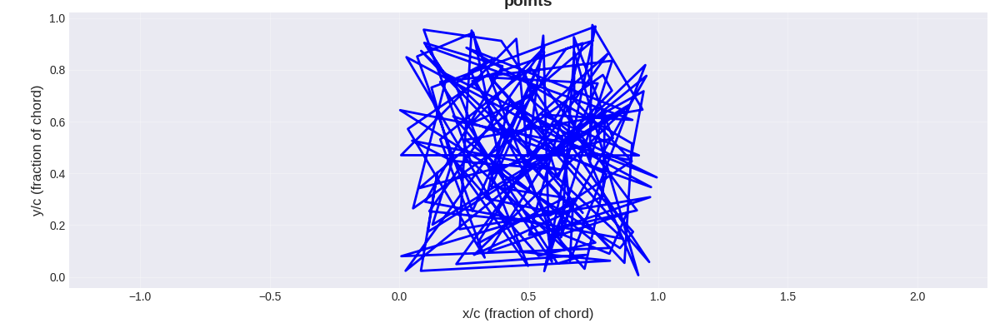

# Take 1

This was my first attempt, and it didn't go very well. There are some bugs somewhere in the solver, because this thing clearly wouldn't fly. It is just a mess of lines.
***
## Parameters
Parameter   | Value
------------|--------
Randomising | Random x and y coordinates
Evaluating  | NeuralFoil
Breeding    | Averaging x and y coordinates
***
## Results
The angle of attack is 8.5 degrees and a Reynold's number of 3558657.5. According to my solver, it has a lift to drag ratio of infinity! You can find the exact points [here](points.csv), and the script to analyse them [here](../analyse.py).
***
## Explanation
The sharp angles and conflicting panel lead to a lot of turbulence, which my solver can't handle perfectly when there's this much. This leads to wildly wrong L/D values, which my algorithm then exploits to max out the values.
