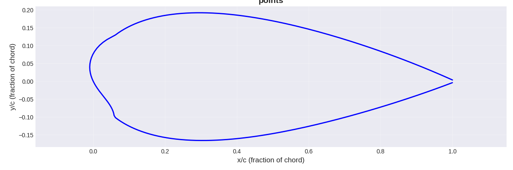

# Take 2

***
## Parameters
Parameter   | Value
------------|--------
Randomising | Random NACA 4-digit airfoil
Evaluating  | Panel method solver
Breeding    | Averaging x and y coordinates
***
## Results
This "airfoil" got a score of 80.11001388418829 at 8 degrees and a Reynold's number of 3471205. You can find the exact points [here](points.csv), and the script to analyse them [here](../analyse.py).
***
## Explanation
This was my second attempt, and it also didn't go very well. It went a little better than my first attempt, as it started with actual airfoils, but it quickly went off. This was because, when averaging points, it also added small mutations. This led to parts of the airfoil having sharp spikes, which creates a lot of turbulence which my solver can only approximate.