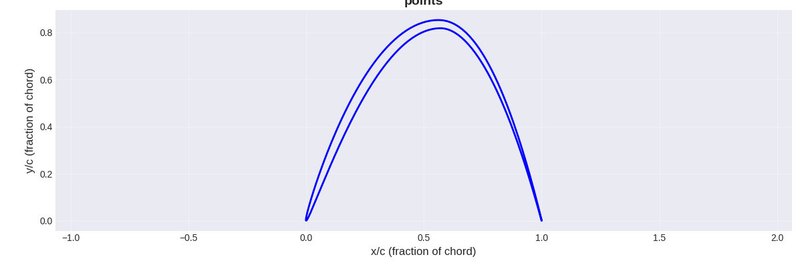

# Take 3

Parameter   | Value
------------|--------
Randomising | Random NACA 4-digit airfoil
Evaluating  | Panel method solver
Breeding    | Averaging max camber dev, location and thickness
L/D         | 89.29986997518414
This was my third attempt, and it went a lot better than the other two.