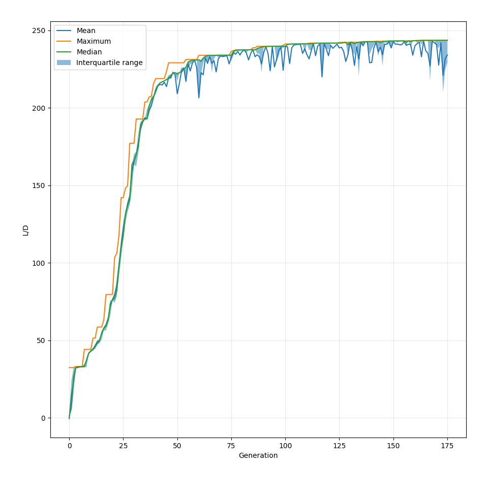

# Take 4

***
Here, I plotted a graph of L/D (my fitness function) against generation, with the mean, maximum, median and interquartile range all plotted. You can see how it spikes up sharply at the start, then plateaus off quickly, although it still progresses.